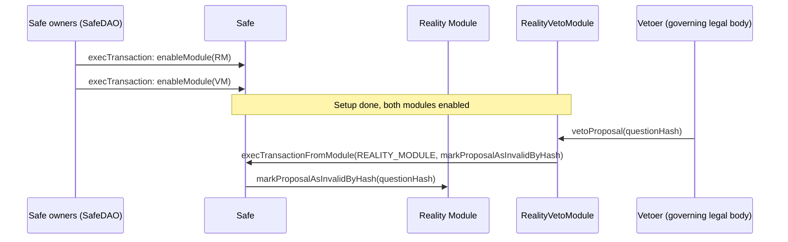
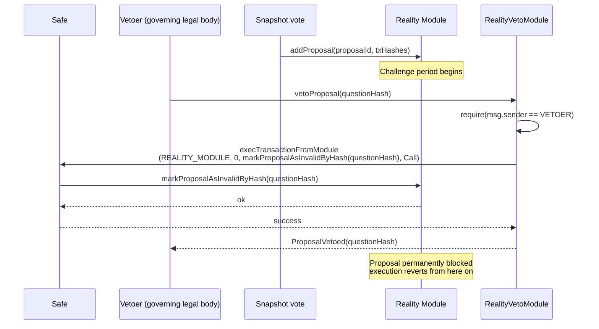

# Governance Contracts

Solidity contracts and Foundry tooling for governance/periphery modules that build on top of [Safenet](https://github.com/safe-research/safenet) and Safe's [Zodiac](https://github.com/gnosisguild/zodiac) module standard, but live outside Safenet's core protocol.

## Reality Veto Module

[`RealityVetoModule`](./src/RealityVetoModule.sol) gives one address a narrow, negative-only power over a Safe that uses a [zodiac-module-reality](https://github.com/gnosisguild/zodiac-module-reality) (Reality/SafeSnap) module: it can invalidate a pending proposal before it executes, and it can do nothing else. It cannot approve, execute, or otherwise act as the Safe.

### Motivation

SafeDAO's Gnosis Chain Safe executes transactions via SafeSnap: a Snapshot vote is followed by a challenge period on a Reality module, after which anyone can execute the proposal's transactions through the Safe. A governing legal body needs a way to stop a proposal within that window for legal/compliance risk management. It must never gain the ability to approve or execute transactions itself. SafeDAO governance must stay the only approval path.

A Safe module is the right tool for this: it can bypass owner signatures and the threshold for exactly the one action a module is built for, without touching the rest of the Safe's authority. But enabling the governing legal body directly as a module would grant it full control, since it could call `execTransactionFromModule` with arbitrary `to` and `data`. `RealityVetoModule` closes that down to a single hardcoded call by sitting between them:

- `SAFE`, `REALITY_MODULE` and `VETOER` are set once in the constructor and are immutable. No admin function changes them.
- The only external function, `vetoProposal(bytes32 questionHash)`, is callable only by `VETOER` and always targets `REALITY_MODULE` with the same encoded call (`markProposalAsInvalidByHash`). There is no path from `vetoProposal` to any other `to`/`data` pair.

This makes the module's own access control ( `msg.sender == VETOER` ) the entire security boundary. See the contract's NatSpec for the full threat model.

### Architecture



`RealityVetoModule` sits alongside the Reality module as a second, independent module enabled on the same Safe. It does not modify or wrap the Reality module. It only ever makes the Safe call the Reality module's own `markProposalAsInvalidByHash`, the same call SafeDAO owners could already make themselves via a full-threshold `execTransaction`. This requires the Safe to be the Reality module's owner, since `markProposalAsInvalidByHash` is owner-gated. The module exists purely to make that one call available to a single address without going through owner signatures, so a veto can land inside the SafeSnap challenge window.

#### Veto flow



### Setup

Requirements: [Foundry](https://getfoundry.sh) and [Just](https://github.com/casey/just). The repo-root [Justfile](../../Justfile) covers every package, this one included (run `just --list` for the full set):

```
just build   # forge build
just test    # forge test -vvv
just check   # forge fmt --check && forge lint --deny notes
just fix     # forge fmt
```

Or run Foundry directly from this directory (`forge build`, `forge test -vvv`, etc).

Repo layout:

| Path | What's there |
| --- | --- |
| [`src/`](./src) | The contracts, and the minimal vendored `ISafe`/`IRealityModule` interfaces it depends on |
| [`script/`](./script) | Deployment script and the [operator runbook](./script/README.md) |
| [`test/`](./test) | Unit tests (mocked Safe/Reality module) and an e2e test against real Safe + zodiac-module-reality bytecode |

### Usage

Deploying the module, enabling it on the Safe, vetoing a proposal, monitoring, rotating the vetoer, and emergency revocation are all covered end-to-end in **[`script/README.md`](./script/README.md)**. Read that before deploying or operating this module. In short:

1. Deploy `RealityVetoModule` with the target Safe, its Reality module, and the vetoer address (all immutable, choose carefully).
2. SafeDAO owners enable it on the Safe with a normal, full-threshold `enableModule` transaction.
3. The vetoer calls `vetoProposal(questionHash)` any time before a proposal's transactions finish executing.

### Further reading

- Operator runbook: [`script/README.md`](./script/README.md)
- Threat model and invariants: NatSpec in [`src/RealityVetoModule.sol`](./src/RealityVetoModule.sol)
